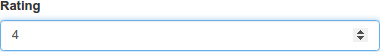
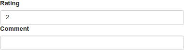
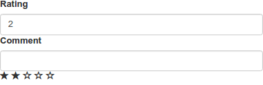
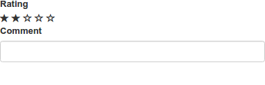

CUSTOM RENDERER (TYPESCRIPT)
============================

Even if the default controls that are created by the default renderers of JSON Forms are probably a good fit for several scenarios, you may still want to customize the rendered forms in certain places.
This can be done by registering a custom renderer that produces a different UI control. On this page, you will learn how to create and register a custom renderer in an application that uses *Typescript*. Please note that there is a separate guide that explains [how to create a custom renderer in an application that uses Javascript](#/docs/customrenderer).

In this guide, we will replace the default renderer for integer values

{:.img-responsive}

so that it will use a *rating control* as shown below instead.

{:.img-responsive}

Running the Typescript seed project
-----------------------------------

To get started quickly, JSON Forms provides project seeds. In this guide, we will use this project seed for Typescript applications. Clone this project seed in order to have a ready-to-use AngularJS application that uses JSON Forms and install all relevant dependencies using the following command:

* `git clone https://github.com/eclipsesource/jsonforms-typescript-seed.git`
* `npm start`

Once the dependencies are installed and the local server started, you should see the following web page at [localhost:8080](http://localhost:8080).

{:.img-responsive}

The most important files in this project seed are the following:

* `src/index.html` is the main HTML file and contains the JSONForms directive to render a form. The data as well as the data schema is obtained from a `RatingController`.
* `src/index.ts` contains the `RatingController`, which provides a simple data object and a data schema.

If you look at `src/index.ts`, you will see that the data schema in this application specifies an object with two properties, `rating` of type `integer` and `comment` of type `string`. Moreover, it defines an instance of this data schema, which only contains the value `2` for the property `rating`.

```Typescript
class RatingController {
  data = {
    'rating': 2
  };
  schema = {
    "type": "object",
    "properties": {
      "rating": {
        "type": "integer",
        "maximum": 5
      },
      "comment": {
        "type": "string",
        "minLength": 3
      }
    }
  };
}
```

The `RatingController` is used in `src/index.html` to provide the input to the JSON Forms directive in order to render a form for the data object and the data schema.

```HTML
<body ng-controller="RatingController as vm">
  <jsonforms data="vm.data" schema="vm.schema"></jsonforms>
</body>
```

Preparing the rating control
----------------------------

To implement the rating control like below
{:.img-responsive}
we use `ui-bootstrap`. Therefore, we first add the project dependency `"angular-ui-bootstrap": "1.3.3"` in `package.json` and import it in `index.ts` as follows

```
import "bootstrap/dist/css/bootstrap.css";
import "angular-ui-bootstrap";
import 'angular-ui-bootstrap/src/rating';
```

Now, we can add the rating control to the `index.html` in order to test that we have all dependencies. Let us put the following tag into `index.html`:

```
<body ng-controller="RatingController as vm">
  <jsonforms data="vm.data" schema="vm.schema"></jsonforms>
  <uib-rating ng-model="2" max="5"></uib-rating>
</body>
```

When we refresh the browser, we should now see the following:
{:.img-responsive}

As you can see, we are able to use the ui-bootstrap control in our HTML code. So it is time now to use it in a custom JSON forms renderer. But let us remove the tag `<uib-rating ng-model="2" max="5"></uib-rating>` from `index.html`, as we just added it there to test `ui-bootstrap`.

Defining your custom renderer
-----------------------------

To create a custom renderer, we have to do three steps.

1. Create an Angular directive
2. Provide a controller for the directive
3. Register a new renderer that uses the created directive

Let us create the new Typescript file `src/rating-control.ts` that will contain those three things mentioned above and import it in `src/index.ts` by adding `import "./rating-control.ts"`.

### Create an Angular directive

In order to create an Angular directive, we add the code below to `src/rating-control.ts`.

```
import "jsonforms";
import {AbstractControl, Testers, schemaTypeIs, schemaPropertyName, PathResolver} from "jsonforms";

class RatingControlDirective implements ng.IDirective {
  template = `
    <jsonforms-control>
      <uib-rating
        id="{{vm.id}}"
        readonly="vm.uiSchema.readOnly"
        ng-model="vm.modelValue[vm.fragment]"
        max="vm.max()"></uib-rating>
      </uib-rating>
    </jsonforms-control>`;
  controller = RatingControl;
  controllerAs = 'vm';
}
```

As you can see above, we created a new Angular directive, which provides a template and a controller. The template introduces the tag `jsonforms-control`, which contains the `uib-rating` tag from ui-bootstrap. As parameters of this tag, we use values provided from a controller `RatingControl`, which we still need to implement, but we can already see that we set the `readonly` flag as specified in the respective UI schema and bind the value of this control to a specific model value. Moreover, we configure the parameter `max`, which indicates the maximum number of stars a user may give in the control, to a value that is computed in a function of `RatingControl`.

### Provide a controller for the directive

Let us now implement the `RatingControl` by adding the following code to `src/rating-control.ts`.

```
class RatingControl extends AbstractControl {
  static $inject = ['$scope'];
  constructor(scope: ng.IScope) {
    super(scope);
  }

  max(): number {
    var schemaElement = PathResolver.resolveSchema(this.schema, this.schemaPath);
    if (schemaElement['maximum'] !== undefined) {
      return <number>schemaElement['maximum'];
    } else {
      return 5;
    }
  }
}
```

The `RatingControl` subclasses `AbstractControl`, a class in JSON Forms providing the base functionality for controls. Besides the constructor, which only forwards the `$scope` to the superclass, this class provides the function `max()`, which we already used when defining the directive to specify the maximum number of stars we would like to see in the control. In the function `max()`, we want to obtain the maximum value as specified in the data schema.

```
"rating": {
  "type": "integer",
  "maximum": 5 // <- this is the value we want to obtain
}
```

Therefore, we first resolve the data schema element for which this renderer should render a UI control. As we subclassed `AbstractControl`, we may access the current schema using `this.schema` and the path to the current element in this schema using `this.schemaPath`. To resolve the actual schema element, we use the `PathResolver`, a helper class of JSON Forms, to resolve the actual schema element from the current schema.

```
var schemaElement = PathResolver.resolveSchema(this.schema, this.schemaPath);
```

Now, we can check whether `schemaElement` has a property `maximum`. If yes, we will return its value; otherwise, we return a default maximum value of `5`.

### Register a new renderer that uses the created directive

Finally, the only thing that is left to do is to register the created directive and specify when we want to use our custom renderer. Therefore, we add the following code to `src/rating-control.ts`.

```
export default angular
  .module('my', ['jsonforms.renderers.controls'])
  .directive('ratingControl', () => new RatingControlDirective())
  .run(['RendererService', RendererService =>
  RendererService.register('rating-control',
    Testers.and(
      schemaTypeIs('integer'),
      schemaPropertyName('rating')
      ), 101)
]).name;
```

With this code, we tell Angular about our new directive `ratingControl` and register it at the `RendererService`. Therefore, we specify its name `rating-control` and define when it should be activated. For defining when the renderer should be activated, JSON Forms provides `Testers`. These testers checks whether the schema element is of type `integer` and the property name is `rating`. Thus, our new renderer will only be activated for one particular property.

After we registered the new renderer, we can refresh the browser and should see our new renderer in action.

{:.img-responsive}
